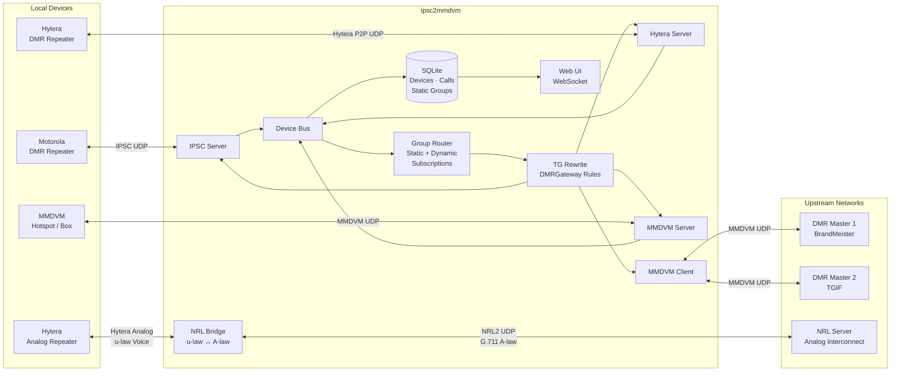

# ipsc2mmdvm

[](https://github.com/hicaoc/ipsc2mmdvm/actions/workflows/release.yaml) [](https://github.com/hicaoc/ipsc2mmdvm) [](https://goreportcard.com/report/github.com/hicaoc/ipsc2mmdvm) [](https://github.com/hicaoc/ipsc2mmdvm/blob/main/LICENSE) [](https://github.com/hicaoc/ipsc2mmdvm/releases/) [](https://codecov.io/gh/hicaoc/ipsc2mmdvm)

**Connect Motorola/Hytera repeaters and MMDVM devices through one bridge.**

ipsc2mmdvm is a protocol bridge that translates between Motorola's IP Site Connect (IPSC), Hytera traffic, and the MMDVM Protocol. It can connect to upstream MMDVM masters such as BrandMeister/TGIF, accept inbound self-registering MMDVM hotspot clients, persist device metadata to SQLite, and expose a real-time web UI for online devices and recent call history.

## How It Works



Motorola, Hytera and MMDVM devices connect to the box running ipsc2mmdvm. The software acts as an IPSC master for Motorola repeaters, a P2P peer for Hytera repeaters, and an MMDVM server for hotspot/box clients. Voice and data traffic is forwarded to and from one or more upstream DMR masters over the internet. Hytera analog repeaters can be bridged to NRL servers for analog interconnect. DMRGateway-style rewrite rules let you route specific talkgroups to specific masters.

## Requirements

- A **Motorola IPSC-capable DMR repeater**, **Hytera DMR repeater**, or **MMDVM hotspot/box** (one or more)
- A **Raspberry Pi** (any model with Wi-Fi and an Ethernet port) or any **Linux box with a spare NIC**
- An **Ethernet cable** to connect the repeater directly to the Pi/Linux box (Motorola/Hytera), or network access (MMDVM)
- **Internet access** on the Pi/Linux box (via Wi-Fi on a Raspberry Pi, or a second NIC on a Linux box)
- A **DMR Master** with a registered repeater ID to connect to (e.g. BrandMeister)

## Setup

### 1. Download ipsc2mmdvm

Download the latest release tarball for your platform from the [GitHub Releases](https://github.com/hicaoc/ipsc2mmdvm/releases/latest) page. For a Raspberry Pi, grab the [`linux_arm64`](https://github.com/hicaoc/ipsc2mmdvm/releases/latest) build, for desktop Linux use [`linux_amd64`](https://github.com/hicaoc/ipsc2mmdvm/releases/latest). Extract it and move the binary to your PATH:

```bash
tar xzf ipsc2mmdvm_*_linux_arm64.tar.gz
sudo mv ipsc2mmdvm /usr/local/bin/ipsc2mmdvm
```

### 2. Create the Config File

Download the example config, edit it, then move it into place:

```bash
wget https://raw.githubusercontent.com/hicaoc/ipsc2mmdvm/main/config.example.yaml -O ipsc2mmdvm.yaml
nano ipsc2mmdvm.yaml
sudo mv ipsc2mmdvm.yaml /etc/ipsc2mmdvm.yaml
```

Here is the full example config with comments:

```yaml
log-level: info
display-ip: "10.10.250.1"    # shared display IP in web runtime info (IPSC + Hytera)

ipsc:
  enabled: true
  port: 50000             # UDP port the repeater will connect to
  auth:
    enabled: false        # Set to true if you configured an auth key in CPS
    key: ""               # Hex string, up to 40 characters (must match CPS)

hytera:
  enabled: true
  p2p-port: 50001
  dmr-port: 30001
  rdac-port: 30002
  enable-rdac: false

metrics:
  enabled: false          # Enable Prometheus metrics endpoint
  address: ":9100"        # Address to serve metrics on (e.g. ":9100" for all interfaces)

storage:
  path: "ipsc2mmdvm.db"   # SQLite database for devices and call history

web:
  enabled: true
  address: ":9201"        # Web UI and WebSocket endpoint

local:
  id: 9000000             # Local bridge identity, independent from any external device
  callsign: "IPSC2MMDVM"
  color-code: 1

mmdvm-client:
  - name: "BrandMeister"  # Friendly name for logging
    master-server: "3104.master.brandmeister.network:62031"  # BrandMeister master
    password: "passw0rd"  # Your BrandMeister hotspot password

    callsign: N0CALL      # Your callsign
    radio-id: 123456789   # Your registered repeater DMR ID

    # Frequencies in Hz:
    rx-freq: 429075000
    tx-freq: 424075000

    color-code: 7         # Must match your repeater's color code (0-15)

    # Optional, reported to BrandMeister:
    # latitude: 30.000000
    # longitude: -97.000000
    height: 3             # Antenna height in meters
    location: "My City, ST"
    # description: ""
    # url: ""

    # Rewrite rules (optional, DMRGateway-compatible)
    # tg-rewrite:
    #   - from-slot: 1
    #     from-tg: 9
    #     to-slot: 1
    #     to-tg: 9
    #     range: 1

  # Add more masters for multi-network support:
  # - name: "TGIF"
  #   master-server: "tgif.network:62031"
  #   password: "secret"
  #   callsign: N0CALL
  #   radio-id: 123456789
  #   rx-freq: 429075000
  #   tx-freq: 424075000
  #   color-code: 7
  #   height: 3
  #   tg-rewrite:
  #     - from-slot: 2
  #       from-tg: 31665
  #       to-slot: 2
  #       to-tg: 31665
  #       range: 1
  #
mmdvm-server:
  # - name: "LocalHotspot"
  #   listen: ":62031"  # default inbound MMDVM client port
  #   password: "secret"
  #   # Clients register their own callsign / DMRID / model at runtime.
  #   pass-all-tg: [1, 2]
```

**Config notes:**

- **`ipsc.enabled` / `hytera.enabled`** - Set to `false` to run only the MMDVM side. In that mode the program can still connect to BM/TGIF and maintain session state by itself.
- **Listener bind address** - IPSC/Hytera listeners bind on `0.0.0.0` (all local addresses). Use the host IP that your repeater can reach as CPS "Master IP/Gateway IP".
- **`display-ip`** - Shared runtime display IP used by both IPSC and Hytera in web "System Info". Does not affect actual bind address.
- **`ipsc.port`** - The UDP port to listen on. The default `50000` works fine. Must match the "Master UDP Port" in CPS.
- **`mmdvm-client[].name`** - A friendly name for an outbound MMDVM network, used in log messages (e.g. `"BrandMeister"`, `"TGIF"`).
- **`mmdvm-server[].name`** - A friendly name for an inbound MMDVM listener, used in log messages.
- **`mmdvm-client`** - Outbound MMDVM master connections such as BrandMeister or TGIF.
- **`mmdvm-client[].master-server`** - The master's host and port. For BrandMeister, find the master covering your region in the [BrandMeister Master Server List](https://brandmeister.network/?page=masters). The format is `host:port` (e.g. `3104.master.brandmeister.network:62030`).
- **`mmdvm-server`** - Inbound listeners that accept MMDVM hotspot/box clients.
- **`mmdvm-server[].listen`** - UDP listen address used by the local MMDVM server. Default is `:62031`. Connected boxes self-register into SQLite automatically.
- **`mmdvm-client[].password` / `mmdvm-server[].password`** - Shared password used for the MMDVM protocol handshake.
- **`mmdvm-client[].radio-id`** - Your outbound repeater/hotspot DMR ID, registered at [radioid.net](https://radioid.net/).
- **`storage.path`** - SQLite file used for the unified device inventory and call history.
- **`web.address`** - Web management UI address. Open `http://host:9201/` after startup.
- **`local.id`** - Local bridge DMR ID used when Moto/Hytera/MMDVM traffic is synthesized or forwarded without depending on any single external device.

### 3. Configure the Motorola Repeater (CPS)

Open your repeater's codeplug in the **Motorola Customer Programming Software (CPS)** and make the following changes:

> **Important:** You must enable **Expert Mode** first: go to **View → Expert** in the CPS menu bar.

#### Network Settings

|       Setting       |                              Value                               |
| ------------------- | ---------------------------------------------------------------- |
| **DHCP**            | **Disabled**                                                     |
| **Ethernet IP**     | A static IP on the same subnet as your server IP (e.g. `10.10.250.2`) |
| **Gateway IP**      | Your server IP (the host running ipsc2mmdvm)                          |
| **Gateway Netmask** | Use the same subnet mask as the repeater Ethernet IP             |

#### Link Establishment

|        Setting         |                                                              Value                                                              |
| ---------------------- | ------------------------------------------------------------------------------------------------------------------------------- |
| **Link Type**          | **Peer**                                                                                                                        |
| **Master IP**          | Your server IP (the host running ipsc2mmdvm, e.g. `10.10.250.1`)                                                                |
| **Master UDP Port**    | The `ipsc.port` value from your config (e.g. `50000`)                                                                           |
| **Authentication Key** | *(Optional)* Up to 40 hex characters. If set, enable `ipsc.auth.enabled` and put the same key in `ipsc.auth.key` in the config. |

Write the codeplug to the repeater.

### 4. Connect the Hardware

1. **Plug an Ethernet cable** directly from your repeater's Ethernet port to the Ethernet port on your Raspberry Pi (or spare NIC on your Linux box).
2. Make sure the Pi/Linux box has **internet access** through a different interface (Wi-Fi on a Pi, or a second NIC).

> **Note:** The Ethernet interface connected to the repeater is dedicated to ipsc2mmdvm. Do not use it for anything else, ipsc2mmdvm will assign it an IP address automatically.

### 5. Run ipsc2mmdvm

ipsc2mmdvm requires root privileges to configure the network interface. Run it from the directory containing your config file, or copy the config to the working directory:

```bash
sudo ipsc2mmdvm
```

By default, ipsc2mmdvm looks for `config.yaml` in the current directory. You can also place the config at a known location and run from that directory:

```bash
cd /etc && sudo ipsc2mmdvm
```

On startup you should see the repeater register and traffic will begin flowing to BrandMeister.

### Web UI

When `web.enabled` is true, open `http://<server>:9201/` to view:

- online Moto repeater / Hytera repeater / MMDVM box inventory
- current IP / port, callsign, DMRID, model and saved notes
- recent 50 calls in real time through WebSocket
- historical calls loaded from SQLite on page load

### Running as a systemd Service

To have ipsc2mmdvm start automatically on boot, create a systemd service file:

```bash
sudo tee /etc/systemd/system/ipsc2mmdvm.service << 'EOF'
[Unit]
Description=ipsc2mmdvm - IPSC to MMDVM Bridge
After=network-online.target
Wants=network-online.target

[Service]
Type=simple
WorkingDirectory=/etc
ExecStart=/usr/local/bin/ipsc2mmdvm -config /etc/ipsc2mmdvm.yaml
Restart=on-failure
RestartSec=5

[Install]
WantedBy=multi-user.target
EOF
```

Then enable and start it:

```bash
sudo systemctl daemon-reload
sudo systemctl enable ipsc2mmdvm
sudo systemctl start ipsc2mmdvm
```

Check status and logs:

```bash
sudo systemctl status ipsc2mmdvm
sudo journalctl -u ipsc2mmdvm -f
```

## Configuration Reference

All settings can also be set via **environment variables** using `_` as a separator (e.g. `IPSC_PORT=50000`).

### General

|   Setting   |  Type  | Default |                   Description                   |
| ----------- | ------ | ------- | ----------------------------------------------- |
| `log-level` | string | `info`  | Log verbosity: `debug`, `info`, `warn`, `error` |

### IPSC

|       Setting       |  Type  |    Default    |                 Description                 |
| ------------------- | ------ | ------------- | ------------------------------------------- |
| `display-ip`        | string | -             | Shared display IP for IPSC/Hytera runtime info |
| `ipsc.port`         | uint16 | -             | UDP listen port                             |
| `ipsc.auth.enabled` | bool   | `false`       | Enable IPSC authentication                  |
| `ipsc.auth.key`     | string | -             | Hex authentication key (up to 40 chars)     |

### MMDVM (array — one entry per DMR master)

|         Setting         |  Type   | Default |                   Description                    |
| ----------------------- | ------- | ------- | ------------------------------------------------ |
| `mmdvm[].name`          | string  | -       | Friendly name for this network (used in logging) |
| `mmdvm[].master-server` | string  | -       | DMR master `host:port`                           |
| `mmdvm[].password`      | string  | -       | Hotspot password                                 |
| `mmdvm[].callsign`      | string  | -       | Your amateur radio callsign                      |
| `mmdvm[].radio-id`      | uint32  | -       | Your registered DMR repeater ID                  |
| `mmdvm[].rx-freq`       | uint    | -       | Receive frequency in Hz                          |
| `mmdvm[].tx-freq`       | uint    | -       | Transmit frequency in Hz                         |
| `mmdvm[].tx-power`      | uint8   | `0`     | Transmit power in dBm                            |
| `mmdvm[].color-code`    | uint8   | `0`     | DMR color code (0–15)                            |
| `mmdvm[].latitude`      | float64 | `0`     | Latitude (−90 to +90)                            |
| `mmdvm[].longitude`     | float64 | `0`     | Longitude (−180 to +180)                         |
| `mmdvm[].height`        | uint16  | `0`     | Antenna height in meters                         |
| `mmdvm[].location`      | string  | -       | Location description                             |
| `mmdvm[].description`   | string  | -       | Repeater description                             |
| `mmdvm[].url`           | string  | -       | Repeater URL                                     |

### Rewrite Rules (per MMDVM entry, optional)

Rewrite rules control how DMR traffic is routed between the repeater and each master. They follow the same semantics as [DMRGateway](https://github.com/g4klx/DMRGateway): the first matching rule wins. If no rewrite rules are configured for a master, all traffic passes through unmodified.

#### TGRewrite — remap group talkgroup calls

|             Setting              | Type | Default |           Description           |
| -------------------------------- | ---- | ------- | ------------------------------- |
| `mmdvm[].tg-rewrite[].from-slot` | uint | -       | Source timeslot (1 or 2)        |
| `mmdvm[].tg-rewrite[].from-tg`   | uint | -       | Source talkgroup start          |
| `mmdvm[].tg-rewrite[].to-slot`   | uint | -       | Destination timeslot (1 or 2)   |
| `mmdvm[].tg-rewrite[].to-tg`     | uint | -       | Destination talkgroup start     |
| `mmdvm[].tg-rewrite[].range`     | uint | `1`     | Number of contiguous TGs to map |

#### PCRewrite — remap private calls by destination ID

|             Setting              | Type | Default |            Description            |
| -------------------------------- | ---- | ------- | --------------------------------- |
| `mmdvm[].pc-rewrite[].from-slot` | uint | -       | Source timeslot (1 or 2)          |
| `mmdvm[].pc-rewrite[].from-id`   | uint | -       | Source private call ID start      |
| `mmdvm[].pc-rewrite[].to-slot`   | uint | -       | Destination timeslot (1 or 2)     |
| `mmdvm[].pc-rewrite[].to-id`     | uint | -       | Destination private call ID start |
| `mmdvm[].pc-rewrite[].range`     | uint | `1`     | Number of contiguous IDs to map   |

#### TypeRewrite — convert group TG calls to private calls

|              Setting               | Type | Default |             Description             |
| ---------------------------------- | ---- | ------- | ----------------------------------- |
| `mmdvm[].type-rewrite[].from-slot` | uint | -       | Source timeslot (1 or 2)            |
| `mmdvm[].type-rewrite[].from-tg`   | uint | -       | Source talkgroup start              |
| `mmdvm[].type-rewrite[].to-slot`   | uint | -       | Destination timeslot (1 or 2)       |
| `mmdvm[].type-rewrite[].to-id`     | uint | -       | Destination private call ID start   |
| `mmdvm[].type-rewrite[].range`     | uint | `1`     | Number of contiguous entries to map |

#### SrcRewrite — match calls by source, remap source ID

|              Setting              | Type | Default |           Description           |
| --------------------------------- | ---- | ------- | ------------------------------- |
| `mmdvm[].src-rewrite[].from-slot` | uint | -       | Source timeslot (1 or 2)        |
| `mmdvm[].src-rewrite[].from-id`   | uint | -       | Source subscriber ID start      |
| `mmdvm[].src-rewrite[].to-slot`   | uint | -       | Destination timeslot (1 or 2)   |
| `mmdvm[].src-rewrite[].to-id`     | uint | -       | Destination source ID start     |
| `mmdvm[].src-rewrite[].range`     | uint | `1`     | Number of contiguous source IDs |
