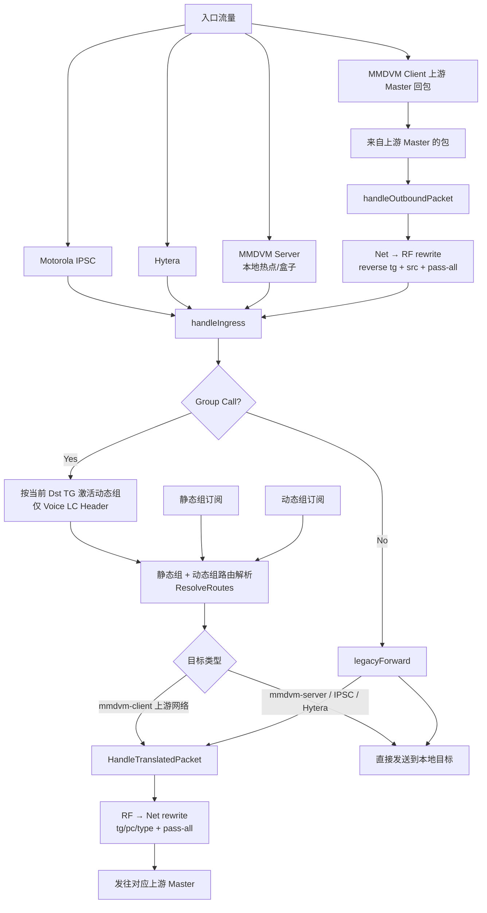
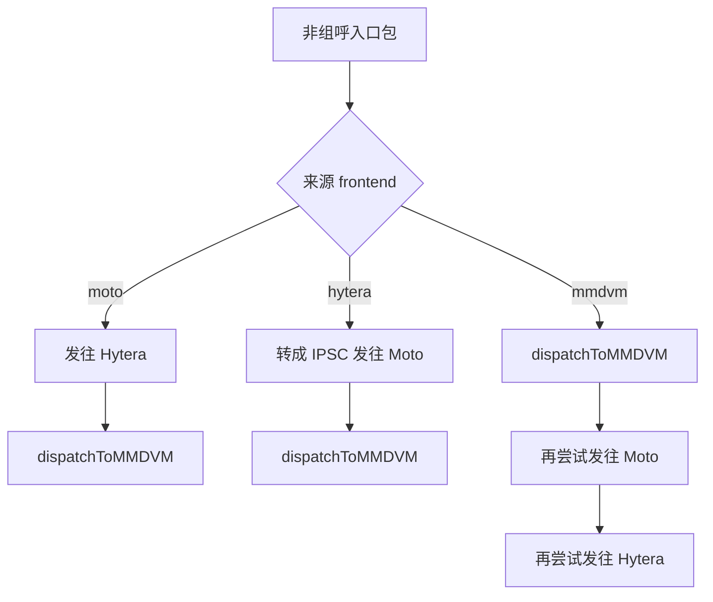

# Rewrite / Group Routing Flow

这张图说明 `DMRGateway-style rewrite rules`、静态组、动态组在项目里的生效层级与方向。



## 关键结论

- `rewrite` 只挂在 `mmdvm-client` 上，也就是“连接上游 DMR Master”的那一路。
- `IPSC`、`Hytera`、`MMDVM Server` 进来的包，如果目标是某个 `mmdvm-client`，才会在发往该上游前触发 rewrite。
- 静态组、动态组先决定“包要发给谁”；rewrite 再决定“发到某个上游 master 前，包要不要改 TG/ID/slot/type”。
- `TGRewrite` 是双向的。
- `PCRewrite`、`TypeRewrite` 只在 RF → Net 生效。
- `SrcRewrite` 只在 Net → RF 生效。
- `mmdvm-server` 自身没有这套 rewrite 规则。

## 一个典型例子

如果本地路由里订阅的是 `TS2 / TG9`，而某个上游 `mmdvm-client` 配了：

```yaml
tg-rewrite:
  - from-slot: 2
    from-tg: 9
    to-slot: 1
    to-tg: 3100
    range: 1
```

那么实际流程是：

1. 本地收到 `TS2 / TG9`。
2. 静态组/动态组层按 `TG9` 决定要把它发给这个上游网络。
3. 发给该上游前，rewrite 把它改成 `TS1 / TG3100`。
4. 上游回来的 `TS1 / TG3100`，再被反向改回本地 `TS2 / TG9`。

## 本地设备能力矩阵

这里的“本地设备”指项目当前直接接入的几类端点：

- Motorola IPSC 对端
- Hytera 对端
- 本地接入的 MMDVM hotspot / 盒子 / 客户端

### 结论速查

| 场景 | 当前支持情况 | 说明 |
| --- | --- | --- |
| 本地设备之间组呼 | 支持 | 走静态组/动态组路由 |
| 本地设备到上游 master 组呼 | 支持 | 先本地路由，再进入 `mmdvm-client` rewrite |
| 上游 master 到本地设备组呼 | 支持 | 先做 `netRewrites`，再进入本地路由 |
| 本地设备之间私呼 | 有条件支持 | 优先按最近活跃 `Dst DMRID -> sourceKey` 定向，否则回落到泛转发 |
| 本地设备到上游 master 私呼 | 有条件支持 | 依赖 `pc-rewrite` / `pass-all-pc` |
| 上游 master 到本地设备私呼 | 有条件支持 | 目标最近在本地某入口活跃过时，可按 recent 缓存回送 |

### 为什么组呼可以，私呼不行

组呼有明确的本地路由表：

- 静态组：设备手工配置订阅哪些 TG
- 动态组：收到组呼的 Voice LC Header 后临时激活

因此组呼可以按 `TG + Slot` 找到目标设备。

私呼目前没有完整、全局、持久的本地寻址表。系统虽然会记录：

- 哪个连接设备在线
- 哪次通话里的 `SrcID`
- 哪次通话里的 `DstID`

也会短时维护：

- `最近活跃手台 DMRID -> sourceKey`

但没有持续维护：

- `目标手台 DMRID -> 当前挂载的本地设备/连接`

因此私呼还不能像组呼那样做完整的全局精准交换，只能优先利用 recent 缓存做“最近位置回送”。

### 私呼当前更接近什么行为

私呼现在更接近“跨前端泛转发”：

- `IPSC` 进来的私呼，会尝试继续发往 `Hytera`、`mmdvm-client` 等
- `Hytera` 进来的私呼，也会尝试发往其它前端
- `MMDVM server` 进来的私呼同理

但它不会像组呼那样依赖一张完整路由表。当前是：

- 先尝试按最近活跃 `Dst DMRID -> sourceKey` 定向
- 定向失败后，再走原来的跨前端泛转发

## legacyForward 实际路径

`legacyForward(...)` 是当前私呼和非组呼流量的主要转发逻辑。它能转发，但不是“按目标手台 DMRID 精准查找后单播”。



### `dispatchToMMDVM` 怎么选目标

它不是广播给所有 `mmdvm-client` / `mmdvm-server`，而是按顺序挑第一个能接包的网络：

1. 先找第一个命中特定 rewrite 规则的网络
2. 如果没有，再找第一个命中 `pass-all-*` 的网络
3. 找到后立即发送并停止

因此它更像：

- “把这个包交给第一个声明自己能处理的 MMDVM 网络”

而不是：

- “枚举所有本地目标并精确匹配私呼对象”

### 为什么这还不算精准私呼路由

因为这里缺少一步关键寻址：

- 根据 `pkt.Dst` 查出“目标手台当前挂在哪个本地设备/连接上”

当前 `legacyForward` 只是把包送往其它前端或某个匹配的 MMDVM 网络，最终是否送到真实目标，依赖对端网络自己是否认识这个私呼目标。

## 最近活跃私呼定向

项目现在额外补了一层“最近活跃手台 DMRID -> sourceKey 缓存”：

- 任一入口收到包时，如果 `Src DMRID` 有值，就记录它最近来自哪个本地入口
- 私呼进入 `legacyForward(...)` 前，先尝试按 `Dst DMRID` 查这个缓存
- 如果命中，就优先定向发回对应入口
- 如果没命中，仍然回落到原来的 `legacyForward` 泛转发逻辑

### 支持范围

| 来源 / 目标类型 | 是否参与最近活跃私呼定向 | 备注 |
| --- | --- | --- |
| `moto` | 支持 | 记录为 `moto:<peerID>`，缺省时退化到 IP |
| `hytera` | 支持 | 记录为 `hytera:<ip>` |
| `mmdvm-server` 本地客户端 | 支持 | 记录为 `mmdvm:<server-name>:<dmrid>` |
| `mmdvm-client` 上游网络 | 支持 | 记录为 `mmdvm-upstream:<name>` |

### 这层能力的含义

它解决的是：

- “目标手台最近确实从某个本地入口说过话，现在再收到私呼时，尽量回到那个入口”

它还没有解决的是：

- “系统全局知道所有手台当前挂在哪个设备上”
- “即使目标最近没发过话，也能仅靠本地状态精准找到它”

因此这仍然是：

- 最近活跃缓存增强的私呼定向

而不是：

- 完整的私呼注册/定位/寻址系统
